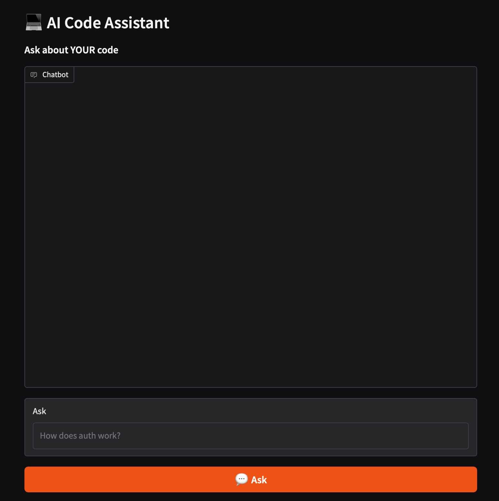

# 💻 AI Code Assistant

> **Ask questions about YOUR codebase** — AI that actually understands your code, not just general programming.

[](https://python.org)
[](LICENSE)
[](https://github.com/walidsobhie-code/ai-code-assistant/stargazers)

[🤗 HuggingFace 🚀 Try Live Demo](https://huggingface.co/spaces/my-ai-stack/ai-code-assistant)

## 🎯 What It Does

```
You: "How does authentication work?"
AI:  "Authentication uses JWT tokens stored in localStorage.
      The flow is: Login → Verify → Store JWT → 
      Attach JWT to all requests → Validate on backend..."

You: "Where is the database connection?"
AI:  "Database connection is in src/db/connection.py
      It uses SQLAlchemy with PostgreSQL..."
```

Stop googling YOUR own code. Ask your AI assistant that knows your codebase.

## ✨ Features

| Feature | Description |
|---------|-------------|
| 🧠 **Understands Your Code** | Indexes your entire codebase |
| 🔍 **Semantic Search** | Find code by what it does, not just names |
| 📊 **Multi-Language** | Python, JavaScript, Go, Rust, Java, etc. |
| 🤖 **GPT-4 Powered** | State-of-the-art code understanding |
| 💬 **Chat Interface** | Ask questions naturally |
| 🎛️ **Gradio UI** | Beautiful web interface |

## 🚀 Quick Start

### Install
```bash
git clone https://github.com/walidsobhie-code/ai-code-assistant.git
cd ai-code-assistant
pip install -r requirements.txt
cp .env.example .env
# Add your OPENAI_API_KEY
```

### Index Your Codebase
```bash
# Index your entire project
python context_loader.py --path ./my_project

# Output:
# 📂 Loading 247 code files...
# ✅ Indexed Python (89 files), JavaScript (67 files), etc.
# 📊 Total chunks: 1,432
```

### Ask Questions
```bash
# Query your codebase
python query_engine.py "How does the payment flow work?"

# 💬 AI: "Payment flow uses Stripe:
#    1. User selects products → Cart.checkout()
#    2. Create Stripe session → Payment.create_session()
#    3. Redirect to Stripe → payment.process()
#    4. Webhook confirms → Order.confirm()
#    Files: payment.py, checkout.py, webhook.py"
```

### Interactive Chat
```bash
python query_engine.py --interactive

# 💬 Chat mode
# You: How does caching work?
# AI: Caching is implemented using Redis in src/cache/redis.py...
# You: Find all API endpoints
# AI: 23 endpoints found in src/api/:
#    - GET /users/:id
#    - POST /orders
#    - PUT /payments/:id
#    ...
```

## 🎨 Web UI Demo

```
┌─────────────────────────────────────────────────────────┐
│  💻 AI Code Assistant                                   │
├─────────────────────────────────────────────────────────┤
│                                                          │
│  📂 Index: my_project/                          [🔄]   │
│  Status: ✅ 247 files indexed                           │
│                                                          │
│  💬 Ask Questions                                       │
│  ┌─────────────────────────────────────────────────┐   │
│  │ How does authentication work?                     │   │
│  └─────────────────────────────────────────────────┘   │
│  [💬 Ask]                                              │
│                                                          │
│  💡 Answer:                                            │
│  Authentication uses JWT tokens:                         │
│                                                          │
│  📄 src/auth/jwt.py (92% match)                    │
│  📄 src/middleware/auth.py (87% match)             │
│  📄 src/routes/auth.py (81% match)                 │
│                                                          │
│  JWT tokens are created on login and validated         │
│  on every protected route...                           │
└─────────────────────────────────────────────────────────┘
```

## 💻 Python API

```python
from context_loader import CodebaseIndexer
from query_engine import CodeAssistant

# Step 1: Index your codebase
indexer = CodebaseIndexer()
result = indexer.index_codebase("./my_project")
print(f"Indexed {result['files']} files")
# Output: Indexed 247 files in 12 languages

# Step 2: Ask questions
assistant = CodeAssistant()
result = assistant.query("Where is the API handler?")
print(result["answer"])
# Output: The API handler is in src/api/handler.py.
# It uses FastAPI with the following routes:...

# Step 3: Get sources
for source in result["sources"]:
    print(f"📄 {source}")
# 📄 src/api/handler.py
# 📄 src/routes/api.py
```

## 🔍 Real Examples

### Understand Legacy Code
```bash
$ python query_engine.py "What does this authentication system do?"

AI: "This is a JWT-based auth system:
    - Login: POST /auth/login → validates credentials
    - Token: Returns JWT with 24h expiry
    - Middleware: Verifies JWT on protected routes
    - Refresh: POST /auth/refresh → renews token
    - Logout: Invalidates token in Redis"
```

### Find Code Fast
```bash
$ python query_engine.py "Find all database queries"

AI: "Found 23 database queries across 12 files:
    - src/models/user.py: get_user(), create_user()
    - src/models/order.py: get_orders(), create_order()
    - src/db/connection.py: query(), transaction()
    ..."
```

### Document Automatically
```bash
$ python query_engine.py "Document the payment module"

AI: "## Payment Module

### Classes
- PaymentIntent: Handles Stripe payment intents
- Refund: Manages partial/full refunds
- WebhookHandler: Processes Stripe webhooks

### Methods
- process_payment(): Initiates Stripe checkout
- confirm_payment(): Confirms payment success
- refund_payment(): Processes refund via Stripe"
```

## 📊 Supported Languages

| Language | Extensions | Status |
|----------|------------|--------|
| Python | .py | ✅ |
| JavaScript | .js, .jsx | ✅ |
| TypeScript | .ts, .tsx | ✅ |
| Java | .java | ✅ |
| Go | .go | ✅ |
| Rust | .rs | ✅ |
| C/C++ | .c, .cpp | ✅ |
| Ruby | .rb | ✅ |
| PHP | .php | ✅ |
| Swift | .swift | ✅ |
| Kotlin | .kt | ✅ |
| Scala | .scala | ✅ |

## 🐳 Docker

```bash
docker build -t code-assistant .
docker run -p 7860:7860 -e OPENAI_API_KEY=your_key code-assistant
```

## 📁 Project Structure

```
ai-code-assistant/
├── context_loader.py    # Index code
├── query_engine.py     # Query code
├── gradio_app.py      # Web UI
├── requirements.txt
├── Dockerfile
└── examples/
    ├── index_project.py
    └── ask_questions.py
```

## 🤝 Contributing

See [CONTRIBUTING.md](CONTRIBUTING.md)

## ⭐ Support

If this saved you time, please star the repo!

---

**Built with ❤️ by [walidsobhie-code](https://github.com/walidsobhie-code)**

## 🖥️ Demo Screenshot



## 🗺️ Roadmap

- [ ] [Planned] Web version / hosted demo
- [ ] [Planned] API endpoint for production use
- [ ] [Planned] Support for more languages
- [ ] [In Progress] Performance optimizations
- [ ] [Done] Gradio web interface
- [ ] [Done] Docker deployment

## 🏢 Used By

> Have a project using this? Send a PR to add your company!

- *(coming soon — be the first to list your project!)*

## 🤝 Contributors

We welcome contributions! Please see [CONTRIBUTING.md](CONTRIBUTING.md) for guidelines.

[](https://github.com/my-ai-stack/ai-code-assistant/graphs/contributors)
